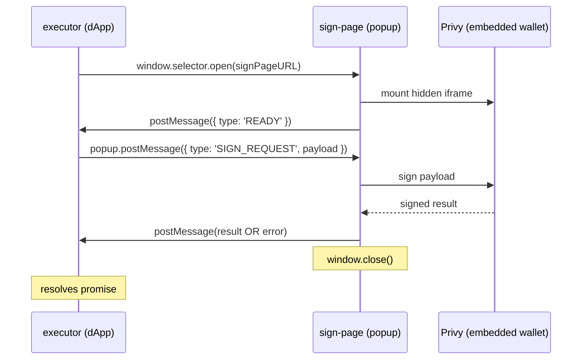

# @peerfolio/privy-near-connect

Privy wallet adapter for near-connect.

## Architecture

This library connects a dApp (via the near-connect SDK) to a developer-hosted sign page that
performs embedded-wallet signing through Privy. Both same-origin and cross-origin deployments
are supported.

### Message flow



### Cross-origin support

The sign page can be hosted on a different origin from the dApp. Pass `allowedOrigins` to
`initSigningPage` to restrict which origins may send a `SIGN_REQUEST`:

```ts
initSigningPage(privy, { allowedOrigins: ['https://dapp.example.com'] });
```

When `allowedOrigins` is omitted, the sign page accepts a `SIGN_REQUEST` from any origin and
locks `trustedOrigin` to whoever sent it. This is safe for development but **production
deployments should always set `allowedOrigins`** to prevent a malicious opener from sending an
unexpected payload.

## Tests

```bash
npm install
npm run test
```

## Example app

The React example in [examples/react](examples/react) provides a simple sign-message UI.

Run the library in watch mode in one terminal:

```bash
npm run build-serve:watch
```

It also serves the lib at localhost:8001, which allows the Near Connector
to fetch the executor code from your local.

Then run the example app in another terminal:

```bash
cd examples/react
npm install
npm run dev
```

Open the app at http://localhost:5173.

## Deploying executor.js to the `release` branch

The `release` branch serves the compiled `executor.js` directly via GitHub's raw content URL:

```
https://raw.githubusercontent.com/beneviolabs/privy-near-connect/refs/heads/release/executor.js
```

The workflow in `.github/workflows/build-executor.yml` runs automatically on every push to `main`. To trigger it manually or set it up for the first time:

1. **Ensure the workflow has write access.** In the repository settings, go to _Settings → Actions → General → Workflow permissions_ and select "Read and write permissions".

2. **Push to `main`** (or trigger manually via _Actions → Build and publish executor.js to release branch → Run workflow_). The workflow will:
   - Install dependencies
   - Build the library with `NODE_ENV=production`
   - Check out (or create) the `release` branch
   - Commit `executor.js` to the root of that branch and push

3. **Verify the artifact** is accessible at the raw URL above. It may take a few seconds after the workflow completes for GitHub's CDN to reflect the latest commit.

> The `release` branch is machine-managed. Do not push to it manually — changes will be overwritten on the next workflow run.

## FAQ and Troubleshooting
- You can copy the manifest in examples/react app and add it to https://azbang.github.io/near-connect/ to do cross-origin. Make sure it's being served already.
- If you run into `Uncaught (in promise) Permission denied` error when launching the signing page or elsewhere it most likely is related to window opening so check the origin being specified and cross-origin access.
