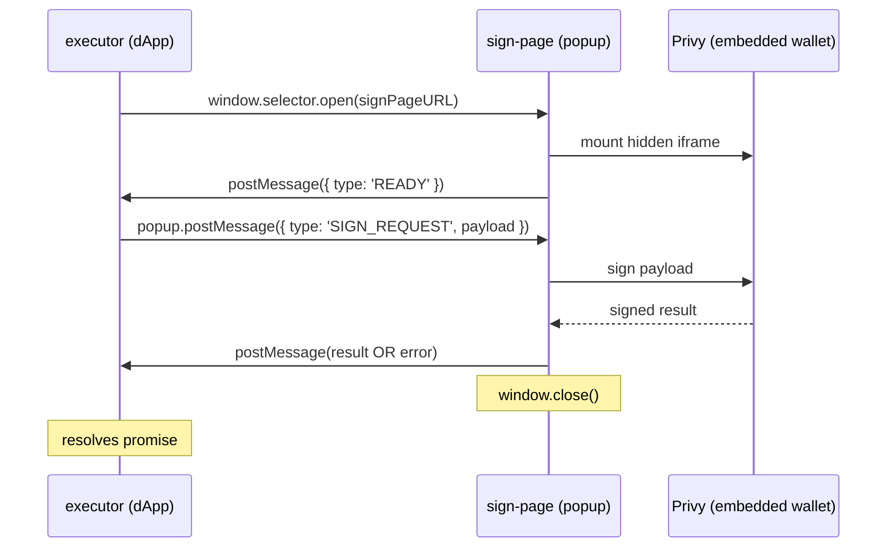

# @peerfolio/privy-near-connect

Privy wallet adapter for near-connect.

## Architecture

This library connects a dApp (via the near-connect SDK) to a developer-hosted sign page that
performs embedded-wallet signing through Privy. Both same-origin and cross-origin deployments
are supported.

### Message flow



### Cross-origin support

The sign page can be hosted on a different origin from the dApp. Pass `allowedOrigins` to
`initSigningPage` to restrict which origins may send a `SIGN_REQUEST`:

```ts
initSigningPage(privy, { allowedOrigins: ['https://dapp.example.com'] });
```

When `allowedOrigins` is omitted, the sign page accepts a `SIGN_REQUEST` from any origin and
locks `trustedOrigin` to whoever sent it. This is safe for development but **production
deployments should always set `allowedOrigins`** to prevent a malicious opener from sending an
unexpected payload.

## Tests

```bash
npm install
npm run test
```

## Example app

The React example in [examples/react](examples/react) provides a simple sign-message UI.

Run the library in watch mode in one terminal:

```bash
npm run build-serve:watch
```

It also serves the lib at localhost:8001, which allows the Near Connector
to fetch the executor code from your local.

Then run the example app in another terminal:

```bash
cd examples/react
npm install
npm run dev
```

Open the app at http://localhost:5173.

## FAQ and Troubleshooting
