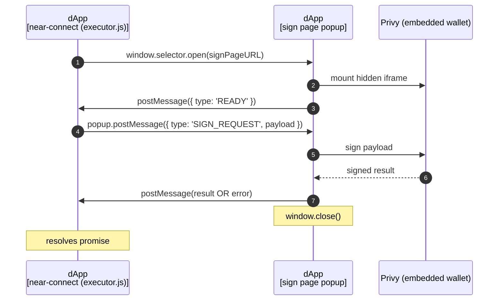

# Privy NEAR Connect

This SDK enables developer's to set up their own NEAR wallet on top of [Privy's embedded wallet infrastructure](https://docs.privy.io/security/wallet-infrastructure/architecture), and connect it to the NEAR ecosystem through the [near-connect lib](https://github.com/azbang/near-connect). It includes a customizable sign page plugin that can be hosted by the developer and used to perform signing operations from any dApp.

While most of the examples from this library use React, the library is framework-agnostic.
An [example React app](./examples/react/) is also included to demonstrate usage of the sign page plugin. It is hosted [here](https://beneviolabs.github.io/privy-near-connect/) but note that you need to plug in your own Privy credentials to work it.

`@peerfolio/privy-near-connect` is the official npm package for this repository. The code is maintained in the `beneviolabs/privy-near-connect` GitHub repository, while the published package uses the `@peerfolio` npm scope.

## Contributing

For development setup, release process, and troubleshooting see [CONTRIBUTING.md](./CONTRIBUTING.md).

## Getting Started

1. Install `@peerfolio/privy-near-connect` NPM package into your project
  ```bash
  npm install @peerfolio/privy-near-connect
  ```

2. Setup Privy per [their docs](https://docs.privy.io/recipes/core-js#prerequisites) to obtain your Privy App ID and Client ID.

   2.1 To obtain the App ID.  `New Application` -> `Configuration-App Settings` -> App ID lives on the `Basics` tab.

   2.2 On the same UI, obtain the Client ID from `Clients` tab -> `Create Client`

4. Setup near-connect on your app

  i. Add a manifest.json to your dApp with the URL of your sign page:

  ```json
  {
  "version": "1.0.0",
  "wallets": [
    {
      "id": "myprivywallet",
      "name": "My Privy Wallet",
      "icon": "https://yourdapp.com/favicon.ico",
      "description": "Web wallet for NEAR.",
      "website": "https://yourdapp.com",
      "version": "1.0.0",
      "executor": "https://raw.githubusercontent.com/beneviolabs/privy-near-connect/refs/heads/release/executor.js",
      "type": "sandbox",
      "platform": {
        "web": "https://yourdapp.com"
      },
      "features": {
        "signMessage": true,
        "signInWithoutAddKey": true,
        "signInAndSignMessage": true,
        "signInWithFunctionCallKey": true,
        "signAndSendTransaction": true,
        "signAndSendTransactions": true,
        "mainnet": true,
        "testnet": true
      },
      "permissions": {
         // important
        "isPrivyConnect": true,
        "storage": true,
        "allowsOpen": [
          "https://yourdapp.com"
        ]
      },
      "metadata": {
        "signPageURL": "https://yourdapp.com/sign"
      }
    },
    ]
  }
  ```

  ii. Initialize near-connect in your dApp and specify the wallet from the manifest:

  ```js
  import { NearConnector } from '@hot-labs/near-connect';

  const connector = new NearConnector({
    manifest: '/manifest.json',
    network: 'mainnet',
  });

  // Listen for account sign in
  connector.on("wallet:signIn", async () => {
    const w = await connector.wallet();
    const accounts = await w.getAccounts({ network });
    // optionally set wallet reference and accounts in your app context
  });

  // Initiates connector and triggers "wallet:signIn"
  // This will open the sign page in a popup and prompt the user to sign in with their wallet. Once they do, the popup will close and the promise will resolve with their account(s).
  // You may want to trigger this in your app's login flow
  await connector.connect({ walletId: 'myprivywallet' }); // walletId should match the id field in your manifest for the wallet you set up.
  ```


4. Setup a signing screen route in your app on `/sign` (or any path you prefer, just make sure to update the manifest.json with the correct URL).

  ```jsx
  // **Option A**: Build your own custom signing page UI
  import { initSigningPage } from '@peerfolio/privy-near-connect/sign-page';
  import Privy from '@privy-io/js-sdk-core';


  // Load these from your app's environment/config. For example, in Vite you might use
  // `import.meta.env.VITE_PRIVY_APP_ID` and `import.meta.env.VITE_PRIVY_APP_CLIENT_ID`.
  // In Next.js the equivalent would typically be
  // `process.env.NEXT_PUBLIC_PRIVY_APP_ID` and `process.env.NEXT_PUBLIC_PRIVY_APP_CLIENT_ID`.
  const PRIVY_APP_ID = import.meta.env.VITE_PRIVY_APP_ID
  const PRIVY_APP_CLIENT_ID = import.meta.env.VITE_PRIVY_APP_CLIENT_ID

  export default function SignPage() {
    // Recommended: Optionally check here that user is authed to Privy
    const privyClient = new Privy({
      appId: PRIVY_APP_ID,
      clientId: PRIVY_APP_CLIENT_ID,
      storage: new LocalStorage(),
    });

    let session;

    // You may also specify the wallet to be used for signing here if a user has multiple wallets in their Privy account. Check the jsdoc for this function for details.
    initSigningPage(privyClient, { allowedOrigins: ['https://yourdapp.example.com'] }).then((s) => { session = s });

    return (
      <div>
        <h1>Wanna sign this?</h1>
        {/* Show the requesting origin so users can verify who is asking */}
        <p>Requested by: <strong>{session?.targetOrigin}</strong></p>
        <pre>
          {JSON.stringify(session?.payload, null, 2)}
        </pre>
        <button onClick={() => {session.sign()}}>
          Sign with your wallet
        </button>
        <button onClick={() => {window.close()}}>
          Reject
        </button>
      </div>
    );
  }

  // **Option B**: Use the SignPagePlugin component for a pre-built signing page UI
  import { SignPagePlugin } from '@peerfolio/privy-near-connect/sign-page-plugin';
  import '@radix-ui/themes/styles.css';
  import '@peerfolio/privy-near-connect/sign-page-plugin/theme.css';

  export default function SignPage() {
    ...
    return <SignPagePlugin privy={privyClient} options={{ allowedOrigins: ['https://yourdapp.example.com'] }} />;
  }
  ```

This page will be opened in a popup by the near-connect SDK when a signing request is made from the dApp.

5. Ensure users can log in with whichever preferred auth method(s) you want to support. Here is an example using SMS login:

  ```jsx
  import { useState } from "react";
  import { useLoginWithSms } from "@privy-io/react-auth";

  export default function LoginWithSms() {
    const [phoneNumber, setPhoneNumber] = useState("");
    const [code, setCode] = useState("");
    const { state, sendCode, loginWithCode } = useLoginWithSms();

    return (
      <div>
        {/* Prompt your user to enter their phone number */}
        <input onChange={(e) => setPhoneNumber(e.currentTarget.value)} value={phoneNumber} />
        {/* Once a phone number has been entered, send the OTP to it on click */}
        <button onClick={() => sendCode({ phoneNumber })}>Send Code</button>

        {/* Prompt your user to enter the OTP */}
        <input onChange={(e) => setCode(e.currentTarget.value)} value={code} />
        {/* Once an OTP has been entered, submit it to Privy on click */}
        <button onClick={() => loginWithCode({ code })}>Log in</button>
      </div>
    );
  }
  ```

  Once a user auths with Privy, the requisite cookies/local storage will be set on their
browser. This allows the sign page to auth during calls to Privy APIs for signing operations.


6. Use the wallet to sign transactions/messages from your dApp as you normally would:

  ```jsx
  const w = await connector.wallet();
  // This will open the signing page you set up in your app to prompt the user to approve the transaction. Once they approve or reject, the popup will close and the promise will resolve with the signed transaction or reject with an error.
  const result = await w.signAndSendTransaction({...txn});
  ```

7. If using a custom Sign Page, ensure that the privy client is initialized before rendering your sign page.
  ```jsx
import React, { useEffect, useState } from 'react';
import Privy, { LocalStorage } from '@privy-io/js-sdk-core';

const privy = new Privy({
  appId: import.meta.env.VITE_PRIVY_APP_ID,
  clientId: import.meta.env.VITE_PRIVY_APP_CLIENT_ID,
  storage: new LocalStorage(),
});

export const PrivySign: React.FC = () => {
  const [ready, setReady] = useState(false);

  useEffect(() => {
    // important if you have a custom domain on privy with
    // httponly cookie access since Privy client will otherwise call auth.privy.io to auth
    // instead of your custom domain, resulting in 401 error.
    privy.initialize().then(() => setReady(true));
  }, []);

  return ready ? (
    <CustomSignPage
      privy={privy as unknown as SignPageProps['privy']}
      ...
    />
  ) : null;
};
  ```

## Architecture

### Message flow


```mermaid
sequenceDiagram
  autonumber
  participant E as dApp<br>[near-connect (executor.js)]
  participant P as dApp<br>[sign page popup]
  participant PR as Privy (embedded wallet)

  E->>P: window.selector.open(signPageURL)
  P->>PR: mount hidden iframe
  P->>E: postMessage({ type: 'READY' })
  E->>P: popup.postMessage({ type: 'SIGN_REQUEST', payload })
  P->>PR: sign payload
  PR-->>P: signed result
  P->>E: postMessage(result OR error)
  Note over P: window.close()
  Note over E: resolves promise
```


### Cross-origin support

The signing page may be hosted on a different origin from the dApp. `allowedOrigins` is required
for `initSigningPage`, so developers must explicitly choose either a restrictive allowlist or every domain:

```ts
initSigningPage(privy, { allowedOrigins: ['https://dapp.example.com'] });
```

Or to allow any origin (e.g. for general-purpose wallets), opt in explicitly:

```ts
initSigningPage(privy, { allowedOrigins: 'dangerouslyAllowAllOrigins' });
```

`'dangerouslyAllowAllOrigins'` is appropriate for general-purpose wallets that accept requests
from any dApp. Most single-dApp deployments should use an explicit origin list to prevent a
malicious window from sending an unexpected payload.
