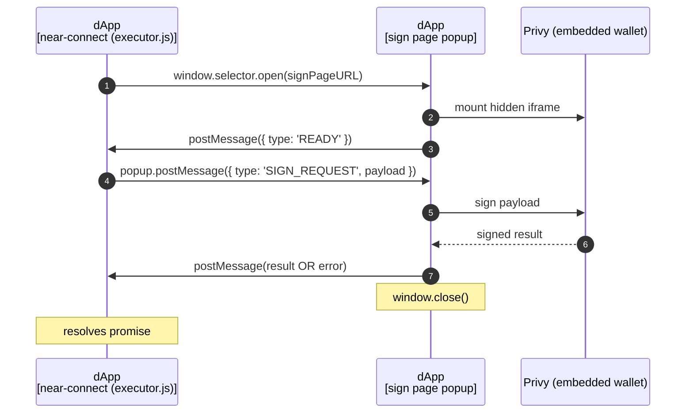

# Privy NEAR Connect

This SDK enables developer's to set up their own NEAR wallet on top of [Privy's embedded wallet infrastructure](https://docs.privy.io/security/wallet-infrastructure/architecture), and connect it to the NEAR ecosystem through the [near-connect lib](https://github.com/azbang/near-connect). It includes a customizable sign page plugin that can be hosted by the developer and used to perform signing operations from any dApp.

While most of the examples from this library use React, the library is framework-agnostic.
An [example React app](./examples/react/) is also included to demonstrate usage of the sign page plugin. It is hosted [here](https://beneviolabs.github.io/privy-near-connect/) but note that you need to plug in your own Privy credentials to work it.

## Getting Started

1. Install `@peerfolio/privy-near-connect` NPM package into your project
  ```bash
  npm install @peerfolio/privy-near-connect
  ```
2. Setup Privy in your app per their docs and ensure user can log in with whichever preferred auth method(s) you want to support. Here is an example using SMS login:

  ```jsx
  import { useState } from "react";
  import { useLoginWithSms } from "@privy-io/react-auth";

  export default function LoginWithSms() {
    const [phoneNumber, setPhoneNumber] = useState("");
    const [code, setCode] = useState("");
    const { state, sendCode, loginWithCode } = useLoginWithSms();

    return (
      <div>
        {/* Prompt your user to enter their phone number */}
        <input onChange={(e) => setPhoneNumber(e.currentTarget.value)} value={phoneNumber} />
        {/* Once a phone number has been entered, send the OTP to it on click */}
        <button onClick={() => sendCode({ phoneNumber })}>Send Code</button>

        {/* Prompt your user to enter the OTP */}
        <input onChange={(e) => setCode(e.currentTarget.value)} value={code} />
        {/* Once an OTP has been entered, submit it to Privy on click */}
        <button onClick={() => loginWithCode({ code })}>Log in</button>
      </div>
    );
  }
  ```

  Once a user auths with Privy, the requisite cookies/local storage will be set on their
browser. This allows the sign page to auth during calls to Privy APIs for signing operations.

3. Setup a signing screen route in your app

  ```jsx
  // On /your-sign-page render
  import { initSigningPage, channelMsg } from '@peerfolio/privy-near-connect/sign-page';

  export default function SignPage() {
    // Recommended: Optionally check here that user is authed to Privy
    const privyClient = new Privy({
      appId: PRIVY_APP_ID!,
      clientId: PRIVY_APP_CLIENT_ID!,
      storage: new LocalStorage(),
    });

    let session;

    // if your user has multiple NEAR wallets you may provide it here
    initSigningPage(privyClient, { allowedOrigins: ['https://yourdapp.example.com'] }).then((s) => { session = s });

    return (
      <div>
        <h1>Wanna sign this?</h1>
        <pre>
          {JSON.stringify(session?.payload, null, 2)}
        </pre>
        <button onClick={() => {session.sign()}}>
          Sign with your wallet
        </button>
        <button onClick={() => {window.close()}}>
          Reject
        </button>
      </div>
    );
  }

  // alternatively, you may use the customizable SignPagePlugin component provided by this library
  import { SignPagePlugin } from '@peerfolio/privy-near-connect/sign-page-plugin';
  import '@radix-ui/themes/styles.css';
  import '@peerfolio/privy-near-connect/sign-page-plugin/theme.css';

  export default function SignPage() {
    ...
    return <SignPagePlugin privy={privyClient} />;
  }
  ```

This page will be opened in a popup by the near-connect SDK when a signing request is made from the dApp.

4. Setup near-connect on your app

  i. Add a manifest.json to your dApp with the URL of your sign page:

  ```json
  {
  "version": "1.0.0",
  "wallets": [
    {
      "id": "myprivywallet",
      "name": "My Privy Wallet",
      "icon": "https://yourdapp.com/favicon.ico",
      "description": "Web wallet for NEAR.",
      "website": "https://yourdapp.com",
      "version": "1.0.0",
      "executor": "https://raw.githubusercontent.com/beneviolabs/privy-near-connect/refs/heads/release/executor.js",
      "type": "sandbox",
      "platform": {
        "web": "https://yourdapp.com"
      },
      "features": {
        "signMessage": true,
        "signInWithoutAddKey": true,
        "signInAndSignMessage": true,
        "signInWithFunctionCallKey": true,
        "signAndSendTransaction": true,
        "signAndSendTransactions": true,
        "mainnet": true,
        "testnet": true
      },
      "permissions": {
         // important
        "isPrivyConnect": true,
        "storage": true,
        "allowsOpen": [
          "https://yourdapp.com",
        ]
      },
      "metadata": {
        "signPageURL": "http://yourdapp.com/sign"
      }
    },
    ]
  }
  ```

  ii. Initialize near-connect in your dApp and specify the wallet from the manifest:

  ```js
  const connector = new NearConnector({
    manifest: '/manifest.json',
    network: 'mainnet',
  });

  // Listen for account sign in
  connector.on("wallet:signIn", async () => {
    const w = await connector.wallet();
    const accounts = await w.getAccounts({ network });
    // optionally set wallet reference and accounts in your app context
  });

  // Initiates connector and triggers "wallet:signIn"
  // This will open the sign page in a popup and prompt the user to sign in with their wallet. Once they do, the popup will close and the promise will resolve with their account(s).
  // You may want to trigger this in your app's login flow
  await connector.connect({ walletId: 'myprivywallet' }); // walletId should match the id field in your manifest for the wallet you set up.
  ```

5. Use the wallet to sign transactions/messages from your dApp as you normally would:

  ```jsx
  const w = await connector.wallet();
  // This will open the signing page you set up in your app to prompt the user to approve the transaction. Once they approve or reject, the popup will close and the promise will resolve with the signed transaction or reject with an error.
  const result = await w.signTransaction({...txn});
  ```

## Development

```bash
npm install
npm run test
```

### Running the example app

The React example in [examples/react](examples/react) provides a simple sign-message UI.

1. Run the library in watch mode in one terminal:

```bash
npm run build-serve:watch
```

It also serves the executor.js file at localhost:8001, which allows the Near Connector
to fetch the executor code from your local.

2. Then run the example app in another terminal:

```bash
cd examples/react
npm install
npm run dev
```

3. Open the app at http://localhost:5173.

### Linking near-connect lib
If you're making simultaneous changes to the near-connect lib locally and want to link this repo's
node modules, you can run

```sh
# from root of hot-labs/near-connect repo
yarn build
cd $DIR/privy-near-connect && \
npm link $DIR/near-connect && \
cd examples/react && \
npm link $DIR/near-connect
```

And later to unlink:
```sh
npm unlink @hot-labs/near-connect --no-save && \
cd examples/react && \
npm unlink @hot-labs/near-connect --no-save
```

## Architecture

### Message flow


```mermaid
sequenceDiagram
  autonumber
  participant E as dApp<br>[near-connect (executor.js)]
  participant P as dApp<br>[sign page popup]
  participant PR as Privy (embedded wallet)

  E->>P: window.selector.open(signPageURL)
  P->>PR: mount hidden iframe
  P->>E: postMessage({ type: 'READY' })
  E->>P: popup.postMessage({ type: 'SIGN_REQUEST', payload })
  P->>PR: sign payload
  PR-->>P: signed result
  P->>E: postMessage(result OR error)
  Note over P: window.close()
  Note over E: resolves promise
```

### Cross-origin support

The signing page can be hosted on a different origin from the dApp. Pass `allowedOrigins` to
`initSigningPage` to restrict which origins may send a `SIGN_REQUEST`:

```ts
initSigningPage(privy, { allowedOrigins: ['https://dapp.example.com'] });
```

When `allowedOrigins` is omitted, the sign page accepts a `SIGN_REQUEST` from any origin and
locks `trustedOrigin` to whoever sent it. This is safe for development but **production
deployments should always set `allowedOrigins`** to prevent a malicious opener from sending an
unexpected payload.

## Deploying executor.js to the `release` branch

The `release` branch serves the compiled `executor.js` directly via GitHub's raw content URL:

```
https://raw.githubusercontent.com/beneviolabs/privy-near-connect/refs/heads/release/executor.js
```

The workflow in `.github/workflows/build-executor.yml` runs automatically on every push to `main`. To trigger it:

1. **Merge to `main`** (or trigger manually via _Actions → Build and publish executor.js to release branch → Run workflow_). The workflow will build executor.js and commit it to the `release` branch.

2. **Verify the artifact** is accessible at the raw URL above. It may take a few seconds after the workflow completes for GitHub's CDN to reflect the latest commit.

> The `release` branch is machine-managed.

## FAQ and Troubleshooting
- You can copy the manifest in examples/react app and add it to https://azbang.github.io/near-connect/ to do cross-origin testing. Make sure it's being served already.
- If you run into `Uncaught (in promise) Permission denied` error when launching the signing page or elsewhere it most likely is related to window opening so check the origin being specified and cross-origin access.
